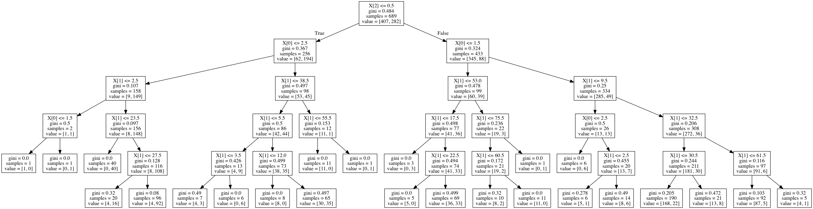

# simple_decision_tree
Simple decision tree made with scikit-learn using the [Titanic survivorship data](https://titanic.businessoptics.biz/survival).

```
$ python3 simple_decision_tree.py
Retrieving Titanic survivorship data...
Retrieved 891 data points successfully.
Added: 689	Excluded: 202	Missing: 0

Making some predictions...
[1, 55, 0] 1
[2, 48, 1] 0
[3, 20, 1] 0
```

You can also visualise the decision tree if you have graphviz installed.

</img>


Required Python dependencies:

* requests
* scikit-learn

Original idea adapted from a tutorial by [||Source||](https://github.com/llSourcell/gender_classification_challenge/blob/master/demo.py)
